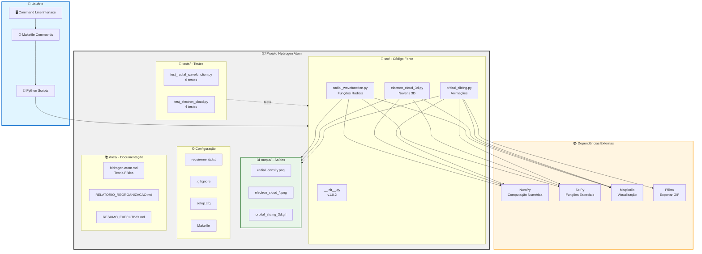
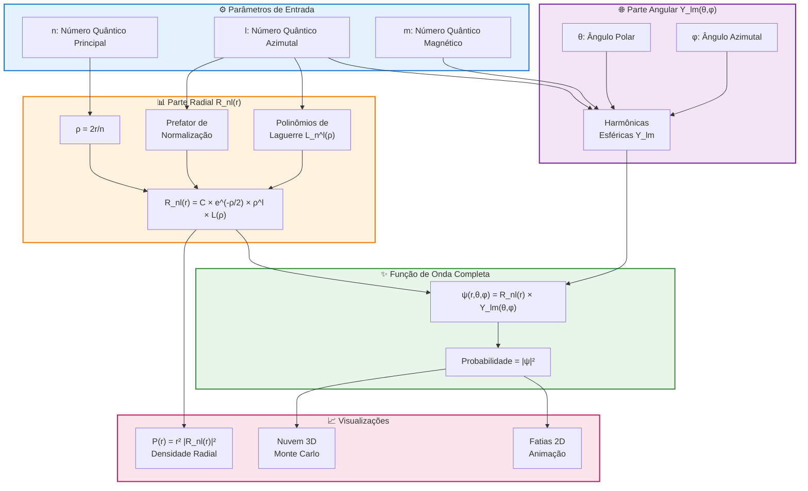
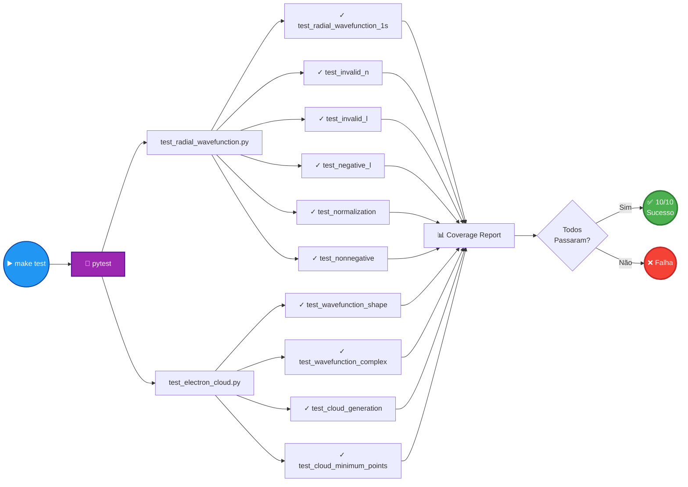
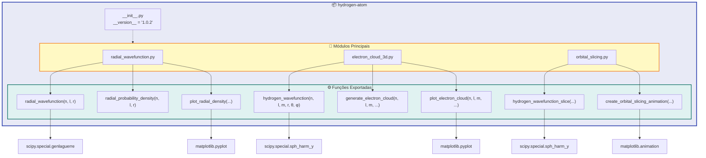
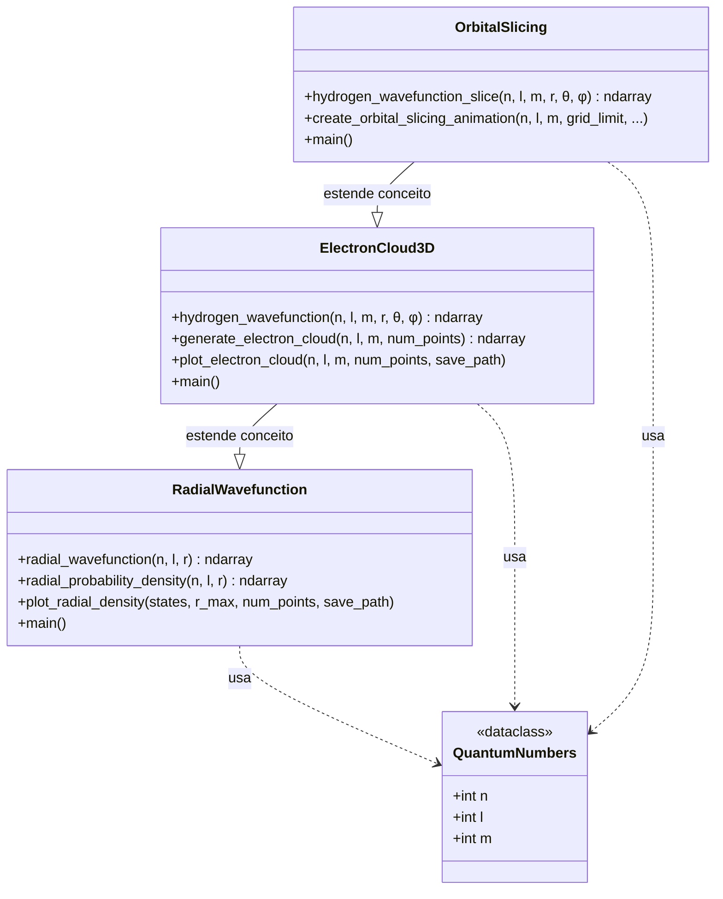
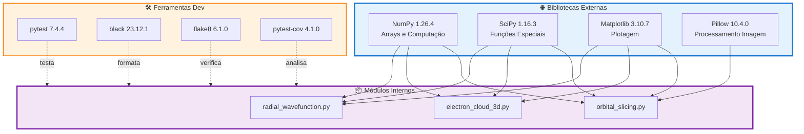

# 🏗️ Arquitetura do Projeto - Hydrogen Atom

## 📐 Visão Geral da Estrutura

## 🔄 Fluxo de Execução

```mermaid
flowchart LR
    Start(("🚀 Início")) --> Setup{"Setup<br/>Executado?"}
    
    Setup -->|Não| MakeSetup["make setup"]
    MakeSetup --> CreateVenv["Criar venv/"]
    CreateVenv --> InstallDeps["Instalar<br/>Dependências"]
    InstallDeps --> Ready["✅ Pronto"]
    
    Setup -->|Sim| Ready
    
    Ready --> Choice{"Escolher<br/>Visualização"}
    
    Choice -->|Radial| RunRadial["make run-radial"]
    Choice -->|Nuvem 3D| RunCloud["make run-cloud"]
    Choice -->|Animação| RunSlicing["make run-slicing"]
    
    RunRadial --> ImportRadial["Importar<br/>radial_wavefunction.py"]
    RunCloud --> ImportCloud["Importar<br/>electron_cloud_3d.py"]
    RunSlicing --> ImportSlicing["Importar<br/>orbital_slicing.py"]
    
    ImportRadial --> CalcRadial["Calcular R_nl(r)"]
    ImportCloud --> CalcCloud["Calcular ψ(r,θ,φ)"]
    ImportSlicing --> CalcSlicing["Calcular ψ(r,θ,φ)"]
    
    CalcRadial --> PlotRadial["Plotar P(r) = r²|R|²"]
    CalcCloud --> MonteCarlo["Monte Carlo<br/>Rejection Sampling"]
    CalcSlicing --> CreateSlices["Criar Fatias Z"]
    
    MonteCarlo --> Plot3D["Plotar<br/>Nuvem 3D"]
    CreateSlices --> Animate["Gerar<br/>Animação"]
    
    PlotRadial --> SaveRadial["💾 output/<br/>radial_density.png"]
    Plot3D --> SaveCloud["💾 output/<br/>electron_cloud_*.png"]
    Animate --> SaveSlicing["💾 output/<br/>orbital_slicing_3d.gif"]
    
    SaveRadial --> End(("✅ Fim"))
    SaveCloud --> End
    SaveSlicing --> End
    
    style Start fill:#4caf50,stroke:#2e7d32,stroke-width:3px,color:#fff
    style End fill:#4caf50,stroke:#2e7d32,stroke-width:3px,color:#fff
    style Setup fill:#ff9800,stroke:#e65100,stroke-width:2px
    style Choice fill:#2196f3,stroke:#0d47a1,stroke-width:2px
```

## 🧮 Fluxo de Cálculos Físicos

## 🧪 Fluxo de Testes

## 📦 Estrutura de Módulos

## 🎨 Diagrama de Classes Simplificado

## 🔗 Dependências e Integrações

## 📁 Mapeamento de Arquivos

```mermaid
graph TB
    Root["📁 hydrogen-atom/"]
    
    Root --> Src["📁 src/"]
    Root --> Tests["📁 tests/"]
    Root --> Output["📁 output/"]
    Root --> Docs["📁 docs/"]
    Root --> Olds["📁 olds/"]
    Root --> Pics["📁 pics/"]
    Root --> Venv["📁 venv/"]
    
    Src --> SrcInit["__init__.py"]
    Src --> SrcRadial["radial_wavefunction.py"]
    Src --> SrcCloud["electron_cloud_3d.py"]
    Src --> SrcSlicing["orbital_slicing.py"]
    
    Tests --> TestInit["__init__.py"]
    Tests --> TestRadial["test_radial_wavefunction.py"]
    Tests --> TestCloud["test_electron_cloud.py"]
    
    Output --> OutReadme["README.md"]
    Output --> OutRadial["radial_density.png"]
    Output --> OutCloud["electron_cloud_*.png"]
    Output --> OutSlicing["orbital_slicing_3d.gif"]
    
    Docs --> DocsTheory["hidrogen-atom.md"]
    Docs --> DocsReport["RELATORIO_REORGANIZACAO.md"]
    Docs --> DocsSummary["RESUMO_EXECUTIVO.md"]
    Docs --> DocsArch["ARCHITECTURE.md"]
    
    Root --> Makefile["Makefile"]
    Root --> Req["requirements.txt"]
    Root --> Git[".gitignore"]
    Root --> Setup["setup.cfg"]
    Root --> License["LICENSE"]
    Root --> Readme["README.md"]
    Root --> Quick["QUICKSTART.md"]
    Root --> Change["CHANGELOG.md"]
    Root --> LeiaMe["LEIA-ME.md"]
    Root --> Status["PROJECT_STATUS.md"]
    
    style Root fill:#ffeb3b,stroke:#f57f17,stroke-width:4px
    style Src fill:#4caf50,stroke:#2e7d32,stroke-width:2px
    style Tests fill:#2196f3,stroke:#0d47a1,stroke-width:2px
    style Output fill:#ff9800,stroke:#e65100,stroke-width:2px
    style Docs fill:#9c27b0,stroke:#4a148c,stroke-width:2px
```

---

**Legenda**:
- 🚀 Pontos de entrada
- 📊 Dados/Saídas
- ⚙️ Configuração
- 🧪 Testes
- 📚 Documentação
- 🔧 Processamento
- ✅ Sucesso
- ❌ Erro
